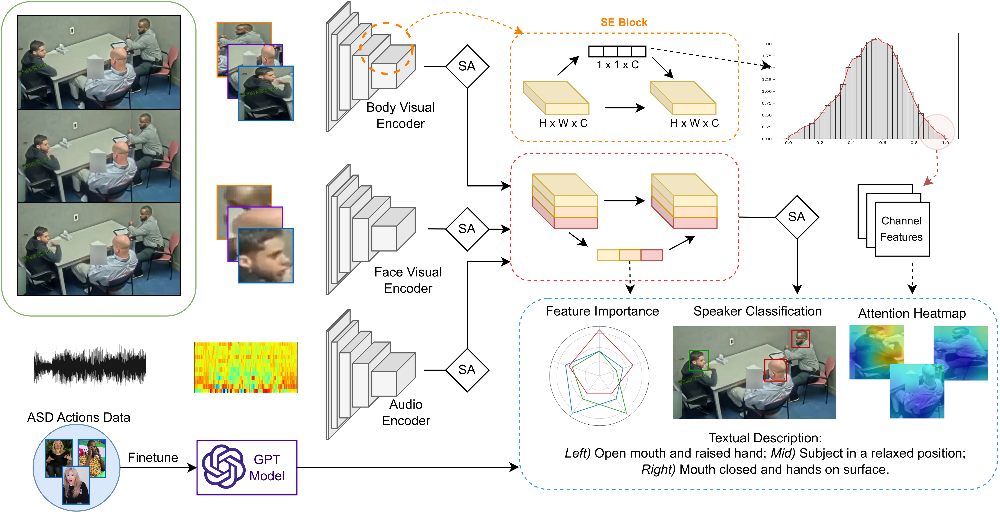
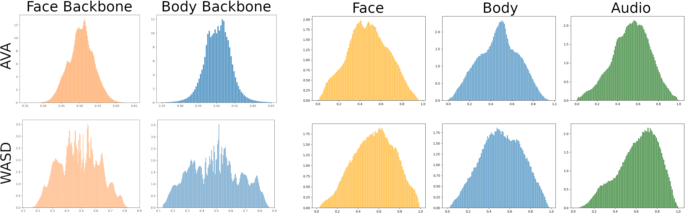
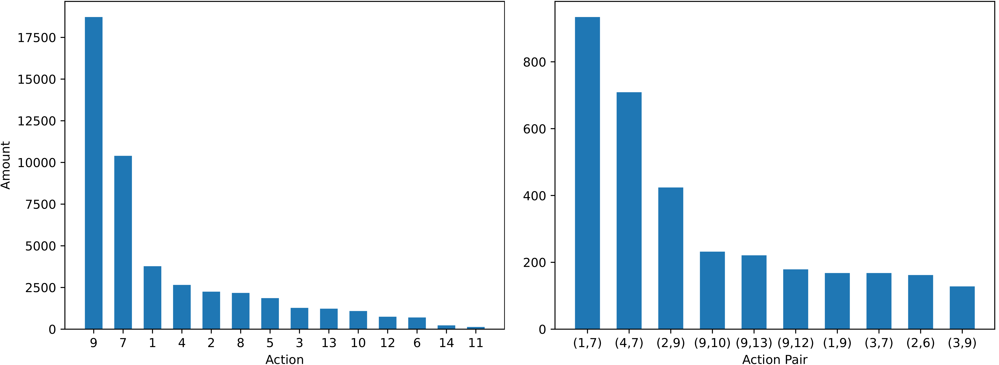
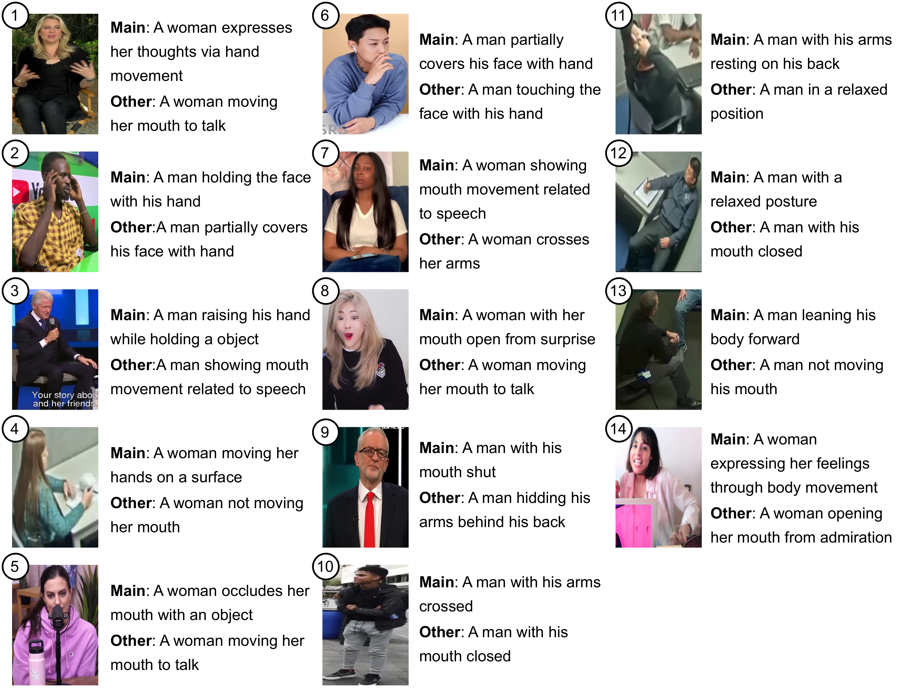
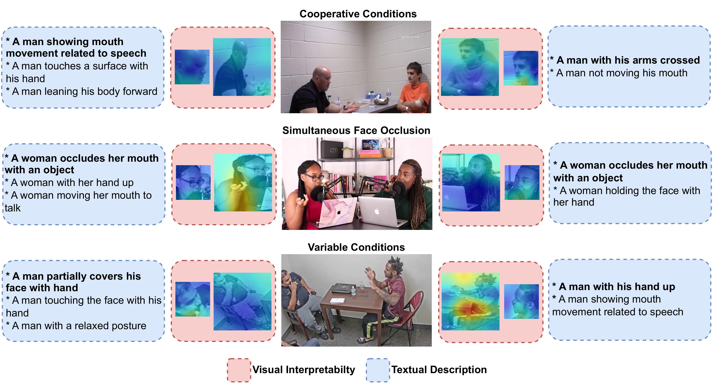

# BIAS: A Body-based Interpretable Active Speaker Approach

*Official Pytorch implementation of the [BIAS: A Body-based Interpretable Active Speaker Approach](https://arxiv.org/abs/2412.05150)*

BIAS is a body-based approach for ASD that uses, for the first time, body data to complement face and audio, achieving state-of-the-art results in cooperative and challenging sets (AVA-ActiveSpeaker [\[github\]](https://github.com/cvdfoundation/ava-dataset) [\[website\]](https://research.google.com/ava/download.html#ava_active_speaker_download) and [WASD](https://tiago-roxo.github.io/WASD/), respectively). Furthermore, we explore the use of [Squeeze-and-Excitation](https://openaccess.thecvf.com/content_cvpr_2018/papers/Hu_Squeeze-and-Excitation_Networks_CVPR_2018_paper.pdf) (SE) blocks to provide reasoning for model decision and analyze the importance of different features, and annotate ASD-related action data to finetune a GPT model, used to provide scene textual descriptions.



*Overview of ASD pipeline with BIAS architecture and GPT model integration. Given a video, body and face data is fed into the respective visual encoders, while audio is processed into MFCC before encoding. SE blocks are used in visual encoders and feature combination for attention heatmaps and feature relative importance, respectively. SA refers to self-attention blocks. Heatmaps are created by combining channel features of the respective top 10% SE vector values. BIAS prediction is based on feature combination, accompanied with visual and statistical interpretability, and complemented with scene textual description from a GPT model finetuned in ASD-related actions data.*

### WASD Performance

BIAS and state-of-the-art models performance on the different categories of WASD using the mean Average Precision (mAP) metric.

| Model                                                        | OC        | SI        | FO        | HVN       | SS        |
|:-------------------------------------------------------------|:---------:|:---------:|:---------:|:---------:|:---------:|
| [ASC](https://github.com/fuankarion/active-speakers-context) | 91.2      | 92.3      | 87.1      | 66.8      | 72.2      |
| [MAAS](https://github.com/fuankarion/MAAS)                   | 90.7      | 92.6      | 87.0      | 67.0      | 76.5      |
| [ASDNet](https://github.com/okankop/ASDNet)                  | 96.5      | 97.4      | 92.1      | 77.4      | 77.8      |
| [TalkNet](https://github.com/TaoRuijie/TalkNet-ASD)          | 95.8      | 97.5      | 93.1      | 81.4      | 77.5      |
| [Light-ASD](https://github.com/Junhua-Liao/Light-ASD)        | 97.8      | 98.3      | 95.4      | 84.7      | 77.9      |
| **BIAS**                                                     | **97.8**  | **98.4**  | **95.9**  | **85.6**  | **82.5**  |


### AVA-ActiveSpeaker Performance

Comparison of BIAS and state-of-the-art models on the AVA-ActiveSpeaker, grouped by the visual encoder used. BIAS has state-of-the-art results in AVA-ActiveSpeaker, competing with models with superior backbones, while being the only one using body data. 

| Model                                                        | Backbone + 2D/3D | Parameters (M) | Body Data    | mAP        |
|:-------------------------------------------------------------|:----------------:|:--------------:|:------------:|:----------:|
| [ASC](https://github.com/fuankarion/active-speakers-context) | ResNet18 2D      | 23.3           | ×            | 87.1       |
| [MAAS](https://github.com/fuankarion/MAAS)                   | ResNet18 2D      | 21.7           | ×            | 88.8       |
| [TalkNet](https://github.com/TaoRuijie/TalkNet-ASD)          | ResNet18* 2D+3D  | 15.0           | ×            | 92.3       |
| **BIAS**                                                     | ResNet18* 2D+3D  | 31.6           | ✓            | **92.4**   |
|                                                              |                  |                |              |            |
| [ASDNet](https://github.com/okankop/ASDNet)                  | ResNext101 3D    | 49.7           | ×            | 93.5       |
| [EASEE-50](https://arxiv.org/pdf/2203.14250v2.pdf)           | ResNet50 3D      | 74.7           | ×            | 94.1       |
| [Light-ASD](https://github.com/Junhua-Liao/Light-ASD)        | Conv 2D-1D       | 1.0            | ×            | 94.1       |

Models with \* customized the reported backbones.


## Visual Interpretability

We modify face and body backbones to include a SE block to infer the channels with higher perceived importance using the corresponding SE vector values and selecting the channels with higher absolute values. 

### Backbone and Feature Histograms


*SE vector values from face and body backbones and feature (audio, body, and face) combination, for BIAS trained in AVA-ActiveSpeaker and WASD. Both datasets follow a normal distribution. AVA refers to AVA-ActiveSpeaker.*

Given the close to normal distribution of values from SE vectors in both used datasets, we select the channels with a SE vector value in the top 90%, following the normal distribution percentile formula.

### Attention Heatmaps

We conjugate the selected channels by bicubic interpolation on top of the original image to provide a heatmap of the most important regions for ASD. Examples of heatmaps in different scenarios are presented in the following figure:


*Context, body and face crops, and respective BIAS attention heatmaps of various scenarios. We group the examples into 4 overlapping sets: 1) face available; 2) occluded or non available face; 3) focus on ASD-body movements, and 4) ignoring body information.*


## Textual Interpretability

We define a set of 14 admissible ASD-related actions, displayed in the table below, with the total annotated data being composed of 47 246 captions and 11 733 images from WASD subvideos (up to 30s), randomly selected from all videos of the WASD train set. Similar to the COCO captions dataset, we divide our annotations into 90/10 train/test.

| Body Part    | #         | Action Label                |
|:-------------|:----------|:---------------------------:|
| Hand         | 1         | Hand raised in the air      |
| Hand         | 2         | Hand touching the face      |
| Hand         | 3         | Hand raised with object     |
| Hand         | 4         | Hand movement (not raised)  |
|              |           |                             |
| Mouth        | 5         | Mouth occlusion with object |
| Mouth        | 6         | Mouth occlusion with hand   |
| Mouth        | 7         | Mouth move from speech      |
| Mouth        | 8         | Mouth move from expression  |
| Mouth        | 9         | Mouth not moving            |
|              |           |                             |
| Arms         | 10        | Crossed arms                |
| Arms         | 11        | Arms behind back            |
|              |           |                             |
| Body         | 12        | Body in relaxed position    |
| Body         | 13        | Body facing forward         |
| Body         | 14        | Wild body movement          |

*ASD-Related actions for ViT-GPT2 model finetuning, grouped by body parts.*

The following figure shows the overall distribution of ASD actions and pair of actions more commonly associated:


*Distribution of ASD-related action (left) and pair of actions more commonly associated (right). Action labels refer to their numbers in the Table above.*

### ViT-GPT2

We finetune a ViT-GPT2 model on WASD data, with ViT trained in ImageNet and GPT2 in WebText, with the base implementation available on [HuggingFace](https://huggingface.co/nlpconnect/vit-gpt2-image-captioning). 

| Model                   | Rouge-L   | METEOR    | BLEU1     | BLEU2     | BLEU3     | BLEU4     |
|:------------------------|:---------:|:---------:|:---------:|:---------:|:---------:|:---------:|
| ViT-GPT2<sub>Base</sub> | 0.28      | 0.18      | 0.14      | 0.03      | 0.01      | 0.00      |
| ViT-GPT2<sub>ASD</sub>  | 0.61      | 0.58      | 0.61      | 0.50      | 0.37      | 0.31      |

*ViT-GPT2 performance increase with finetune on ASD-related data.*

We assess ViT-GPT2 predictions with representative examples of the considered training actions, in the following figure:


*ASD-actions finetuned ViT-GPT2 model predictions in representative images of the 14 considered ASD-related actions of the Table above. Each figure number relates to the respective ASD-action number. ViT-GPT2 predictions contain the main caption and a related one (other).*


## Interpretability Setup


*Combination of SE visual interpretability with ViT-GPT2 model subject description in various scenarios with varying ASD challenges. Bold descriptions are the main prediction of ViT-GPT2.*


## Downloads

#### Pretrained Models

The BIAS model trained on WASD can be downloaded [here](https://drive.google.com/file/d/1emfDPgBAfQGNwMsnW4E6Tduxq2OYyKsB/view?usp=share_link).

The BIAS model trained on AVA-ActiveSpeaker can be downloaded [here](https://drive.google.com/file/d/1HqX6Fgfjz0hfgfmOjdqQ0c0LmPI1oE1Q/view?usp=share_link).

The BIAS model and the steps to train and evaluate it on AVA-ActiveSpeaker and WASD can be found in the `BIAS` folder, accompanied by a `README.md` with a step-by-step guide.

#### BIAS Interpretability

The visual interpretability setup using BIAS can be found in the `BIAS_interpretability` folder, accompanied by a `README.md` with a step-by-step guide. In this folder you can also find the source code to obtain the values to assess feature importance (audio, body, and face). 

#### Textual Interpretability

The textual interpretability setup using ViT-GPT2 can be found in the `textual_interpretability` folder, accompanied by a `README.md` with a step-by-step guide.

The ASD-related captions dataset can be downloaded [here](https://drive.google.com/file/d/1quJtGrFX4mS2DngIQt5dR14uDUZ0gG7M/view?usp=share_link). 


## Cite

```bibtex
@article{roxo2024bias,
  title={BIAS: A Body-Based Interpretable Active Speaker Approach}, 
  author={Roxo, Tiago and Costa, Joana C. and Inácio, Pedro R. M. and Proença, Hugo},
  journal={IEEE Transactions on Biometrics, Behavior, and Identity Science}, 
  year={2024},
  publisher={IEEE},
  doi={10.1109/TBIOM.2024.3520030}
}
```
